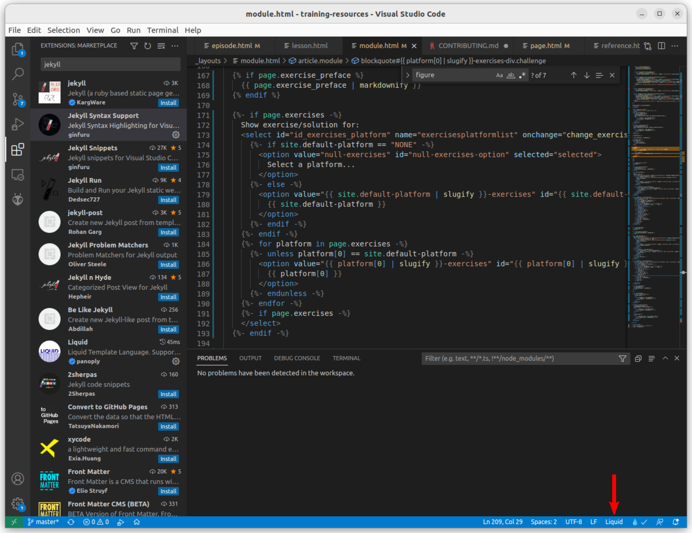

# Contribute

There are already [numerous contributors](https://github.com/NEUBIAS/training-resources/graphs/contributors) to this project and we are always welcoming more!

If you are a first time contributor we recommend expressing your interest by [creating an issue](https://github.com/NEUBIAS/training-resources/issues) where you describe how you would like to contribute. 
We will then get in touch with you to discuss the details, e.g. by having a zoom with you.


## Step by step technical contribution guide

To contribute to this project, please follow those steps:

1. Clone this repository: `git clone https://github.com/NEUBIAS/training-resources/`
1. On your computer, make a new branch. For example, if you would like to contribute python code to the binarization.md module you may: `git checkout -b pythonBinarization`
1. Now add your changes on your computer (staying in this branch) - see "Adding a new module" section, below.
1. When you are done, please `git add .; git commit -m "some message"`
1. Now you can upload your branch to the online repository by typing: `git push --set-upstream origin pythonBinarization`.
1. Go to the online repository on gitlab: https://git.embl.de/grp-bio-it/image-analysis-training-resources
1. On gitlab, there will now be button at the top of the page. Click this button to stage a "merge request" of your contribution (in your branch) to the master branch. There will also a possibility to assign a project maintainer to review your contribution and to merge it. Please select someone appropriate here.
1. Thank you for your contribution!

### Editor

[Visual Studio Code](https://code.visualstudio.com/) supports code formating and highlighting with the [Liquid](https://marketplace.visualstudio.com/items?itemName=sissel.shopify-liquid) and [Jekyll Syntax Support](https://marketplace.visualstudio.com/items?itemName=ginfuru.ginfuru-vscode-jekyll-syntax) extensions (available via VSCode marketplace).

After the extensions are installed the document type can be changed to "Liquid" in the bottom right corner.


This should enable syntax highlighting. By pressing `Ctrl + Shift + p` you can search for `Liquid: Enable Formatting` and `Liquid: Format Document`.

## Adding a new module

Each module page is built from a template (`_layouts/module.html`),
ensuring a consistent structure and style for the whole collection.
To create a new module, you will need to add a few files
in a few different places in this repository. 

For convenience there is the [add_new_module.sh](https://github.com/NEUBIAS/training-resources/blob/master/add_new_module.sh) shell script that will automatically create the file and folder skeleton for a new module. Example usage: `./add_new_module.sh distance_transform`


### Module file

Most important is the module file itself.
This module file should be saved with a short, descriptive name (no spaces!)
ending with the `.md` (Markdown) extension.
The content of this Markdown file can be limited to a header, written in YAML,
according to the specification below.
However, you may wish to add additional page content,
written in Markdown,
beneath the closing `---` of this header.
Any content written there will appear in the rendered page after
the concept map and/or figure, and before the _Activity_ section.

#### YAML Header Specification

All fields not marked as optional are required for the page to build.
You can check that your YAML is valid with [this tool](http://www.yamllint.com/).

```yaml
---
title:     Title of the Module
layout:    module               # don't change this
prerequisites:
  - "a list of things that learners should know"
  - "in order to understand this module"
objectives:
  - "a list of learning objectives"
  - "see note 1 below for more info"
motivation: |
  A description of *why* you would want to learn this.
  Can be written in
  (GitHub-flavoured) [Markdown](https://github.com/adam-p/markdown-here/wiki/Markdown-Cheatsheet).
  Line breaks will be respected, so you can add lists etc using Markdown syntax.
concept_map: > # see note 2
  graph TD
      A[Christmas] -->|Get money| B(Go shopping)
      B --> C{Let me think}
      C -->|One| D[Laptop]
      C -->|Two| E[iPhone]
      C -->|Three| F[fa:fa-car Car];
figure: /figures/mymodule.png # store the example image for your module in the `figures` folder and provide the absolute path from the root of the site here.
figure_legend: Some description of the figure. (optional)
activity_preface: |
  Some general description of the activity for
  that learners will do while studying the module.
  It will be followed by platform-specific instructions/example code.
  (optional)
activities: # platform-specific activity instruction/example code files (see note 3) (optional)
  - ["ImageJ GUI", "mymodule/activities/mymodule_imagejgui.md", "markdown"]
  - ["ImageJ Macro": "mymodule/activities/mymodule_imagejmacro.ijm", "java"]
  - ["Jython", "mymodule/activities/mymodule_jython.py", "python"]
exercises: # platform-specific exercises (in Markdown files) (see note 4) (optional)
  "ImageJ GUI": "mymodule/exercises/mymodule_imagejgui.md"
  "ImageJ Macro": "mymodule/exercises/mymodule_imagejmacro.md"
  "Jython": "mymodule/exercises/mymodule_jython.md"
  "MATLAB": "mymodule/exercises/mymodule_matlab.md"
assessment: |
  Language-agnostic questions to assess learner understanding of the key concept
  covered in the module.
  (optional)
learn_next: # see note 5
  - "[name_of_one](calibration)"
  - "[or_more_modules](object_splitting)"
  - "[to link to next](display)"
external_links:
  - "[link to](https://external.page.com)"
---
```

Notes:

1. Learning objectives should be worded as endings to a sentence beginning "After completing this lesson, learners should be able to...". We recommend starting each learning objective with a verb from [Bloom's Taxonomy](https://cft.vanderbilt.edu/guides-sub-pages/blooms-taxonomy/)
2. Concept maps are drawn with [Mermaid.js](https://mermaidjs.github.io/flowchart.html). The indentation of the chart description is important, so be careful!
3. The `activities` field should be populated with three-entry arrays, where the first value is the name of the platform, the second value is the path to the instructions or script for the activity, and the third is a lower-case language identifier to tell GitHub Pages if and how the content of the file should be highlighted. For files containing activity instructions written in Markdown - as opposed to a script written in some programming language - the value in the third position should be `"markdown"`.
4. The `exercises` field should be populated with key-value pairs, where the key is the name of the platform (e.g. "ImageJ GUI", "Python", etc) and the value is the path (relative to `_includes/`) to the file containing the exercises for that platform.
5. The points in "Learn Next" are Markdown links, which should be formed as `[Module Title](modulefilename)`, where the extension has been removed from the filename.

### Associated files
**THIS HAS NOW CHANGED 2023.04.25 AP. TODO: Review this section** 
Below is a list of all the other files that you should provide
to accompany a new module,
as well as the appropriate location for each
(relative to the top level of the repository).
Examples are given for a `/modules/mymodule.md`

- The `figure` image
  - an file containing an example image to illustrate the concept being taught in the module
  - location: `/figures/mymodule.md`
- The `activities` files
  - Markdown files containing instructions and/or example code for an activity that learners should follow to learn how to apply the concept on a particular platform (ImageJ Macro, MATLAB, etc)
  - location: `_includes/mymodule/activities/mymodule_platformnospaces.md`
- The `exercises` files
  - Markdown files containing exercises to test the learner's understanding of applying the concept on a particular platform
  - location: `_includes/mymodule/exercises/mymodule_platformnospaces.md`

## Adding exercises/activity instructions for a new platform

Contributions of instructions and exercises for more platforms are very welcome - please see the "Associated files" subsection above for details of where these contributed files should be added.

## Customising the material for a course

This repository is designed to work as a central reference point for all modules and platforms. However, we expect that instructors will want to prepare more specific material to be used in individual workshops/courses.

To do this, fork or import\* this repository and follow the steps described below.

\* Each GitHub user can only have a single fork of a repository so importing may be the better choice if you expect to make multiple customised sites from this material.

### Setting a defualt platform

You can specify a default plaform for your site by adjusting the `default-platform` field in the site `_config.yml`. Beware: your choices will be limited by the availability of platform options for exercises and activities throughout the material! If you want to set a default platform that does not have exercises/activities prepared for every module, you should add the paths to any module files missing exercises/activities for your given platform to the `exclude` list in `_config.yml`. This will prevent any errors being raised due to a missing parameter for those modules.

### Adjusting module set and order

Use the `module_order` field in `_config.yml` to specify which modules should appear in your site and in what order. Other modules not mentioned in this list will still be built (unless you add their paths to the `exclude` field) but will not be included in the page navigation i.e. via dropdown menu, next/previous buttons, etc.

## Questions about the module layout

If you have questions about the module layout, please contact image-analysis-support@embl.de.

## Building locally OSX

To test your changes locally, install `jekyll` on your system. Instructions for Mac OSX are here: [https://jekyllrb.com/docs/installation/macos/](https://jekyllrb.com/docs/installation/macos/).

Once you have `jekyll` and `bundler` setup,
clone and move into this repository,
and run:

```bash
make serve
```

All going well, your built pages are now beng served locally.
Copy the URL provided in the output
(should be http://127.0.0.1:4000/image-analysis-training-resources/)
and paste it into your web browser.
Now you can navigate around the locally-built version of the pages
and check whether you're happy to submit your changes to be merged into `master` :+1:


## Building locally Windows (without make)

You need to install several tools (`ruby` and then `jekyll`). Please follow the instructions
[https://jekyllrb.com/docs/installation/windows/] follow step 1-4

All commands are run from a standard/gitbash terminal. 

* Install ruby using the [https://rubyinstaller.org/] (tested with devkit rubyinstaller-devkit-3.0.3-1-x64 used default suggested path etc.  MSYS2 and MINGW development toolchain) 
* Install jekyll
```bash
gem install jekyll bundler
```
* Check your jekyll install
```bash
jekyll -v
```
* Try to compile the page
```bash 
bundle exec jekyll serve
```
* It will probably complain about missing gems. Install those, e.g.
```bash 
gem install github-pages
gem install webrick
```
* Run again 
```bash 
bundle exec jekyll serve
```

* If everything works fine you will get something like
```bash
 bundle exec jekyll serve
Configuration file: D:/Code/training-resources/_config.yml
            Source: D:/Code/training-resources
       Destination: D:/Code/training-resources/_site
 Incremental build: disabled. Enable with --incremental
      Generating...
                    done in 5.007 seconds.
  Please add the following to your Gemfile to avoid polling for changes:
    gem 'wdm', '>= 0.1.0' if Gem.win_platform?
 Auto-regeneration: enabled for 'D:/Code/training-resources'
    Server address: http://127.0.0.1:4000
  Server running... press ctrl-c to stop.
```

* Copy the URL provided in the output, should be http://127.0.0.1:4000/image-analysis-training-resources/)
and paste it into your web browser. Now you can navigate around the locally-built version of the pages
and check whether you're happy to submit your changes to be merged into `master` :+1:

Caveat: Some users must run their ``gem install`` commands as administrator. We do not know exactly why, but it may depend on their respective Windows installation. 

## See your new module
To see a module edit the file *_config.yml*  and add your module (the file name in _modules with .md) to the 
list and the appropriate location
```markdown
module_order:
- pixels
- spatial_calibration
- lut
- binarization
- connected_components
- datatypes
- measure_shapes
- workflow_segment_2d_nuclei_measure_shape
- measure_intensities
- global_background_correction
- filter_neighbourhood
- median_filter
- local_background_correction
- filter_objects
- workflow_segment_2d_noisy_nuclei_filter_objects_measure_shape
- MY_MODULE

```

Note that when jekyll is serving your page, changes on existing files are automatically updated.
