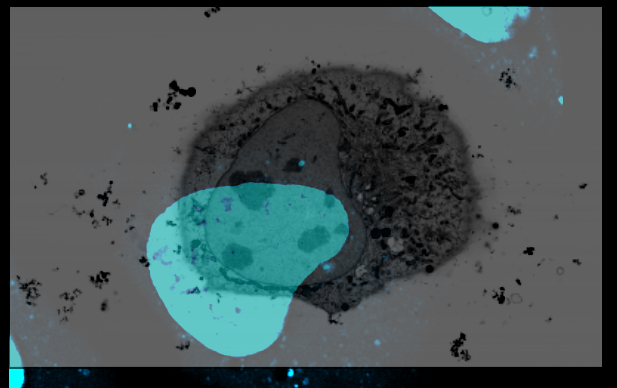

**Requirements:** Fiji (if necessary download from https://fiji.sc)

#### enable MoBIE Update Site

Install Fiji, and enable the MoBIE update site ([how to install an update site](https://imagej.net/Following_an_update_site#Introduction)).  
In detail:

1. Please [install Fiji](https://fiji.sc) on your computer.  
2. Open Fiji and go to [ Help > Update... ] in the menu.  
3. Click [ Manage Update Sites ]  
4. Click the checkbox next to `MoBIE`

    
5. Click [ Close ]  
6. Click [ Apply changes ]  
7. Restart Fiji

#### get started with MoBIE

- Open a MoBIE project containing correlative data
  - `[ Plugins › MoBIE › Open › Open MoBIE Project... ]`
    - `Project Location` `https://github.com/mobie/clem-example-project/`
- Explore the transformation from viewer to global space:
  - Log the current "Data2Global" transformation ("Source Transform") `dgt` and "Global2Viewer" transformation `gvt`
    - BDV context menu: `Log Source Transforms` & `Log Current Location`
  - Zoom in
    - BDV: `arrow up`
  - Log `dgT` and `gvT` again and appreciate that only the `gvT` has changed.
     - Appreciate that the first component of the `gvT` is bigger, corresponding to the higher zoom level.
  - Add another image:
    - MoBIE UI: From the `tomogram` drop-down choose `tomo_37_hm` and click `[ view ]`
  - Appreciate that navigation (i.e. finding the `tomo_37_hm` image) in large correlative data sets is challenging.
  - Focus on the `tomo_37_hm` image:
    - MoBIE UI: `tomo_37_hm` click `[ F ]`
- Explore heterogeneous voxel sizes
  - Toggle off interpolation
    - BDV: `i` (it should say "nearest neighbor interpolation")
  - Zoom in a bit more
    - BDV: `arrow up`
  - Move to the edge of the `tomo_37_hm`
    - BDV: Mouse `right button drag`
  - This information is encoded in the transformations from data space to global space (dgt):
    - [em-overview dgt transformation](https://s3.embl.de/yeast-clem/hela/images/ome-zarr/em-overview.ome.zarr/.zattrs)
    - [tomo_37_nm dgt transformation](https://github.com/mobie/clem-example-project/blob/66064176fa39b9f7d0e94f855f1c4b7d226812d4/data/hela/images/bdv-n5-s3/tomo_37_hm.xml#L38)
- Explore heterodimensional (2D & 3D) rendering
  - Look at the data from the side
    - BDV: `shift y`
  - Zoom out until you see the edges of `em-overview` along the z-axis
    - BDV: `arrow down`
  - Alternatively copy below `gvT` transform into the `location` field and click `[ move ]`
    - `{"normalizedAffine":[-0.0020015317086036193,-0.01932460609735281,-5.114194702548178E-19,6.3944917447396445,-5.114194702548184E-19,-7.789826789933008E-19,0.019427983168573904,-0.0015838942648179167,-0.01932460609735281,0.0020015317086036193,-7.789826789933008E-19,3.638083567375694],"timepoint":0}`
  - Appreciate that the voxels of `em-overview` are rendered 300 nm along the z-axis.
  - This is specified [here](https://github.com/mobie/clem-example-project/blob/de1be447b48e0ce95a302dd1fe33d9b725cd82dd/data/hela/dataset.json#L8950)

[//]: # (- Change the `dgt` &#40;"registration"&#41; of one image:)

[//]: # (  - Focus on `tomo_37_hm`)

[//]: # (    - MoBIE UI: `tomo_37_hm` click `[ F ]`)

[//]: # (  - Log the `dgt`)

[//]: # (    - BDV context menu: `Log Source Transformations`)

[//]: # (  - Change the `dgt` of `tomo_37_hm`:)

[//]: # (    - BDV context menu: `Registration - Manual Transform`)

[//]: # (    - Follow the instructions to change the location of `tomo_37_hm`)

[//]: # (  - Log the `dgT` again &#40;s.a.&#41; and appreciate that it has changed.)

#### register the volume CLEM data

------- 
THIS IS PROBABLY NOT REQUIRED IF DATA IS AVAILABLE LOCALLY

-------

- retreive the original data

  EM: https://www.ebi.ac.uk/empiar/EMPIAR-11537/ (Downscaled (20nm) aligned FIB SEM stack resliced to match the Airyscan dataset)

  LM: https://www.ebi.ac.uk/biostudies/files/S-BSST1075/EM04480_05_4G_Hoechst_GFP-TGN46_agglutinin_mitotracker.czi

- open the LM data in Fiji using the BioFormats Importer plugin. (`Plugins > Bio-Formats > Bio-Formats Importer`)
- you should get a Hyperstack image with 4 channels. (MitoTracker, Agglutinin, GFP-TGN46, and Hoechst)
- adjust the lookup table for each channel to fit the fluorophore. (`Image > Lookup Tables`)
- Currently, the MoBIE project creator only supports single channels, so we have to split the fluorescence stack into separate channels using `Image > Hyperstacks > Make Subset...` and choose the channel number. Do this with each of the 4 channels active.

- create a new MoBIE project: `Plugins > MoBIE > Create > Create New MoBIE project...`

  name the project as you like and create it in a local directory.
- add a new dataset, name it as you like
- select the first channel image in Fiji
- add a new source `current displayed image`, do not tick `make view exclusive`
- call it appropriately (channels are sorted inverse) and choose the `selection group name` as "fluorescence" or "FM"
- open the MoBIE project to see how the scaling and LUT are transferred 

- open the other channel views using the MoBIE UI and explore the multi-channel volume
- right click into the multi-channel viewer and `Save current view`
- `Save as new view`, save to `projcect`
- Call the view something like "all channels" and make it part of the "FM" group
- close MoBIE

- open the EM data in Fiji
- add the volume to MoBIE under the selection group "EM" (make new selection group) to the same dataset. The format conversion can take a couple of minutes.
- open the MoBIE project and view your multichannel FM and EM together
- switch off all fluorescence channels but the Hoechst by clicking on `S`
- change contrast and transparency settings for the relevant sources (`B`)

- right click the image "registration manual", select the EM image as we want to keep the multi-channles where they are, `Start manual transform` drag the image around.
- click `cancel manual Transform` to undo the translation and bring the image back to its original position.

- use the mouse wheel to translate in `z`, make sure rotations are around the viewing axis and press the `z` key. Use the right and left arrow keys to rotate and the up and down to scale (dangerous)
- click `Accept manual Transform` to make it permanent and store the view into the project. This will only save the transformed EM source. Create a new selection group "Registration"