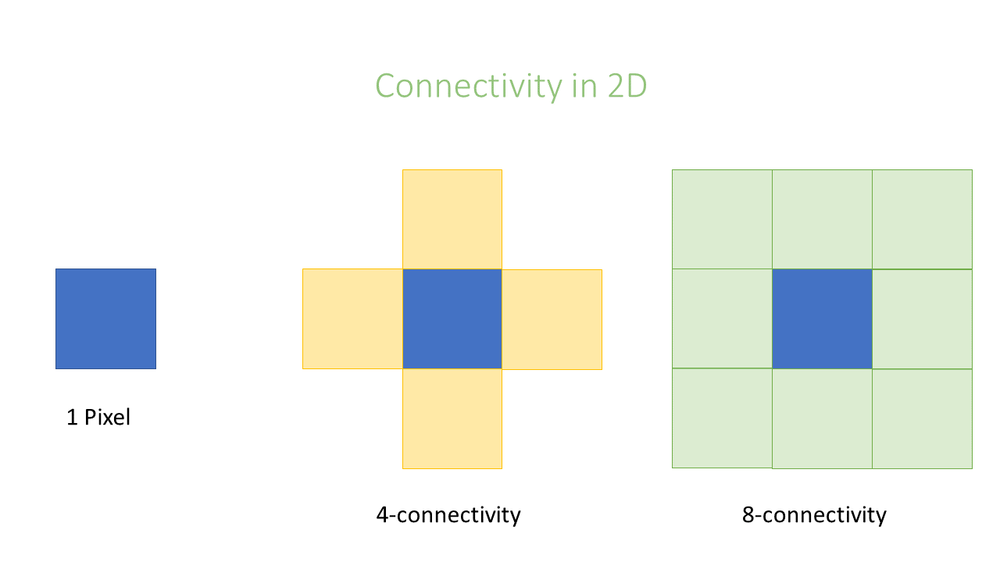

Typically, one first categorise an image into background and foreground regions, which can be represented as a binary image. Such clusters in the segmented image are called connected components. The relation between two or more pixels is described by its connectivity. The next step is a connected components labeling, where spatially connected regions of foreground pixels are assigned (labeled) as being part of one region (object).

In an image, pixels are ordered in a squared configuration. 

For performing a connected component analysis, it is important to define which pixels are considered direct neighbors of a pixel. This is called connectivity and defines which pixels are considered connected to each other.

Essentially the choice is whether or not to include diagonal connections.

Or, in other words, how many orthogonal jumps to you need to make to reach a neighboring pixel; this is 1 or an orthogonal neighbor and 2 for a diagonal neighbor.

This leads to the following equivalent nomenclatures:

- 2D: 1 connectivity = 4 connectivity
- 2D: 2 connectivity = 8 connectivity
- 3D: 1 connectivity = 6 connectivity
- 3D: 2 connectivity = 26 connectivity

