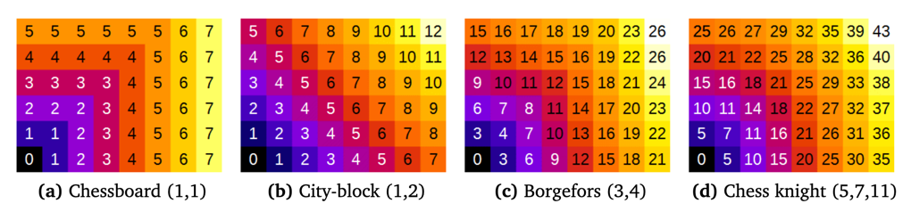

#### Chamfer distance (modified from MorpholibJ Manual)

Several methods (metrics) exist for computing distance maps. The MorphoLibJ library implements
distance transforms based on chamfer distances. Chamfer distances approximate Euclidean
distances with integer weights, and are simpler to compute than exact Euclidean distance
(Borgefors, 1984, 1986). As chamfer weights are only an approximation of the real Euclidean
distance, some differences are expected compared to the actual Euclidean distance map.

Several choices for chamfer weights are illustrated in above Figure (showing the not normalized distance). 

 - The "Chessboard" distance, also named Chebyshev distance, gives the number of moves that an imaginary Chess-king needs to reach a specific pixel. A king can move one pixel in each direction. 
 - The "City-block" distance, also named Manhattan metric, weights diagonal moves differently. 
 - The “Borgefors” weights were claimed to be best approximation when considering the 3-by-3 neighborhood.
 - The “Chess knight” distance also takes into account the pixels located at a distance from
(±1, ±2) in any direction. It is usually the best choice, as it considers a larger neighborhood.

To remove the scaling effect due to weights > 1, it is necessary to perform a normalization step. In MorphoLibJ this is performed by dividing the resulting image by the first weight (option `Normalize weights`).

