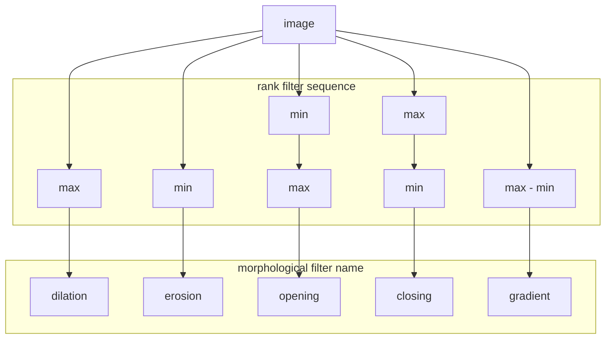

images: [xy_8bit_binary__for_open_and_close.tif](https://github.com/NEUBIAS/training-resources/raw/master/image_data/xy_8bit_binary__for_open_and_close.tif)

# Rank filter sequences

Often rank filters are applied in a sequence. We refer to an opening operation as a max-filter followed by a min-filter of the same size. 
A closing operation is the inverse, a min-filter followed by a max-filter. 

# Morphological filters

## Requirements

- Neighbourhood filters
- Rank filters

## Motivation

This module explains how filters can be used to change size and shape of objects in the image.

## Learning objectives
- Understand how to design morphological filters using rank filters
- Execute morpholofical filters on binary or grayscale images and explain the output

## Concept map

[*] Concept map above assumes bright objects on dark background. For dark objects on bright background effect of min and max filters inverses

### Activity: Explore erosion and dilation on binary images

- Open image: xy_8bit_binary__two_spots_different_size.tif
- Explore how structures grow and shrink, using erosion and dilation

### Activity: Explore opening and closing on binary images

- Open image: xy_8bit_binary__for_open_and_close.tif
- Explore effects of morphological closing and opening:
	- closing can fill holes
	- closing can connect gaps
	- opening can remove thin structures

### Formative assessment

Fill in the blanks, using those words: shrinks, increases, decreases, enlarges.

1. An erosion _____ objects in a binary image.
2. An erosion in a binary image _____ the number of foreground pixels.
3. A dilation in a grayscale image _____ the average intensity in the image.
4. A dilation _____ objects in a binary image.

True of false? Discuss with your neighbour!

1. Morphological openings on binary images can decrease the number of foreground pixels.
2. Morphological closings on binary images never decreases the number of foreground pixels.
3. Performing a morphological closing a twice in a row does not make sense, because the second closing does not further change the image.

## Learn more

- https://en.wikipedia.org/wiki/Morphological_gradient
- https://imagej.net/MorphoLibJ#Grayscale_morphological_filters

=======
