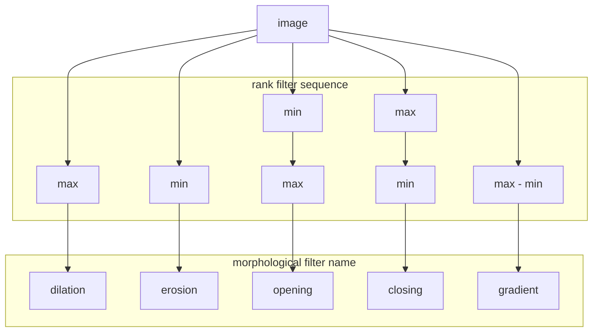

# Morphological filters

## Requirements

- Neighbourhood filters
- Rank filters

## Motivation

This module explains how filters can be used to change size and shape of objects in the image.

## Learning objectives
- Understand how to design morphological filters using rank filters
- Execute morpholofical filters on binary or grayscale images and explain the output

## Concept map

[*] Concept map above assumes bright objects on dark background. For dark objects on bright background effect of min and max filters inverses

### Activity: Explore erosion and dilation on binary images

- Open image: xy_8bit_binary__two_spots_different_size.tif
- Explore how structures grow and shrink, using erosion and dilation

### Activity: Explore opening and closing on binary images

- Open image: xy_8bit_binary__for_open_and_close.tif
- Explore effects of morphological closing and opening:
	- closing can fill holes
	- closing can connect gaps
	- opening can remove thin structures

### Formative assessment

Fill in the blanks, using those words: shrinks, increases, decreases, enlarges.

1. An erosion _____ objects in a binary image.
2. An erosion in a binary image _____ the number of foreground pixels.
3. A dilation in a grayscale image _____ the average intensity in the image.
4. A dilation _____ objects in a binary image.

True of false? Discuss with your neighbour!

1. Morphological openings on binary images can decrease the number of foreground pixels.
2. Morphological closings on binary images never decreases the number of foreground pixels.
3. Performing a morphological closing a twice in a row does not make sense, because the second closing does not further change the image.

## Learn more

- https://en.wikipedia.org/wiki/Morphological_gradient
- https://imagej.net/MorphoLibJ#Grayscale_morphological_filters

---
title:     Rank filters and rank filter sequences (DRAFT)
layout:    module 
prerequisites:
  - "[Pixels](../pixels)"
  - "[Median filters](../median_filter)"
  - "[Neighbourhood image filters](../filter_neighbourhood)"
objectives: 
  - "Understand how rank filters function."
  - "Execute and compare several rank filters."
  - "Understand rank filter sequences on intensity and binary images"

motivation: >
  Typical rank filters are median, min and max filters. 
  When applied to binary images one typically refer to binary operations, such as erosion (min-filter) or dilation (max-filter). 
  For binary images rank filters help to clean up the image before the connected component analysis
  (remove small objects, separate objects, close holes). For intensity images rank filters can be used to compute a 
  local-background. 
  
concept_map: >
  graph TD
    pixel --> NE("neighbourhood pixel values")
    NE --> sorted("sorted pixel values")
    sorted --> min
    sorted --> max
    sorted --> median
    sorted --> ...
    subgraph rank value
    min
    max
    median
    ...
    end
    subgraph replace pixel value
    fpixel1
    end
    median --> fpixel1[rank filtered pixel]
    min -.-> fpixel1
    max -.-> fpixel1
    ... -.-> fpixel1

figure: /figures/rank_filter.png
figure_legend: Scheme of how a rank filter acts on an image
activity_preface: |
  Open an image and investigate the action of a min filter and max filter. Use a binary as an example. 
  Perform an opening operation on the binary. Open an intensity image and perform an opening operation. 
  
activities: 

assessment: | 
 

exercises: 

learn_next:
   
---
# Rank filter sequences

Often rank filters are applied in a sequence. We refer to an opening operation as a max-filter followed by a min-filter of the same size. 
A closing operation is the inverse, a min-filter followed by a max-filter. 