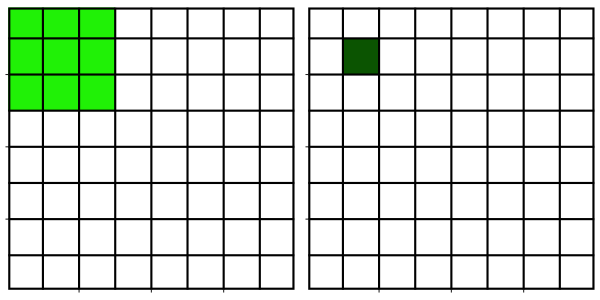

### Neighborhood filters

Neighborhood filters comprise two ingredients: a definition of the pixel neighborhood (size and shape) and a mathematical recipe what to compute on this neighborhood.
The result of this computation will be used to replace the value of the central pixel in the neighborhood. This procedure can be applied to several (all) pixels of an image to obtain a filtered image. The animation shows a square neighborhood (3x3) applied to the inner pixels of the image.

There are tons of different neighborhood filters, and you can also invent one!

#### The neighborhoods

The neighborhood of a pixel is also called a structuring element (SE) and can have various sizes and shapes.
Here, we use one of the simplest and most widely used neighborhoods, namely a circular neighborhood, which is defined by a certain radius. We will explore other shapes of SEs in more detail in a dedicated module.

#### Padding

Since the filtering operation takes into account all the directions of extent of SE, border pixels would be affected in a different way and one has to decide that which values they should assume. Padding is the operation of adding an additional layer around your data to get more accurate values after filtering process. It also gives you option to retain same dimensions for your data after filtering. Common padding methods are using zeros or to mirror/replicate the border pixel values.

#### The math

There are many ways how to cleverly compute on a pixel neighborhood. For example, one class of computations is called convolutional filters, another is called rank filters. Here, we focus on the relatively simple mean and variance filters.

#### Best practice

As usual, everything depends one the scientific question, but maybe one could say to use a filter that changes the image as little as possible.
