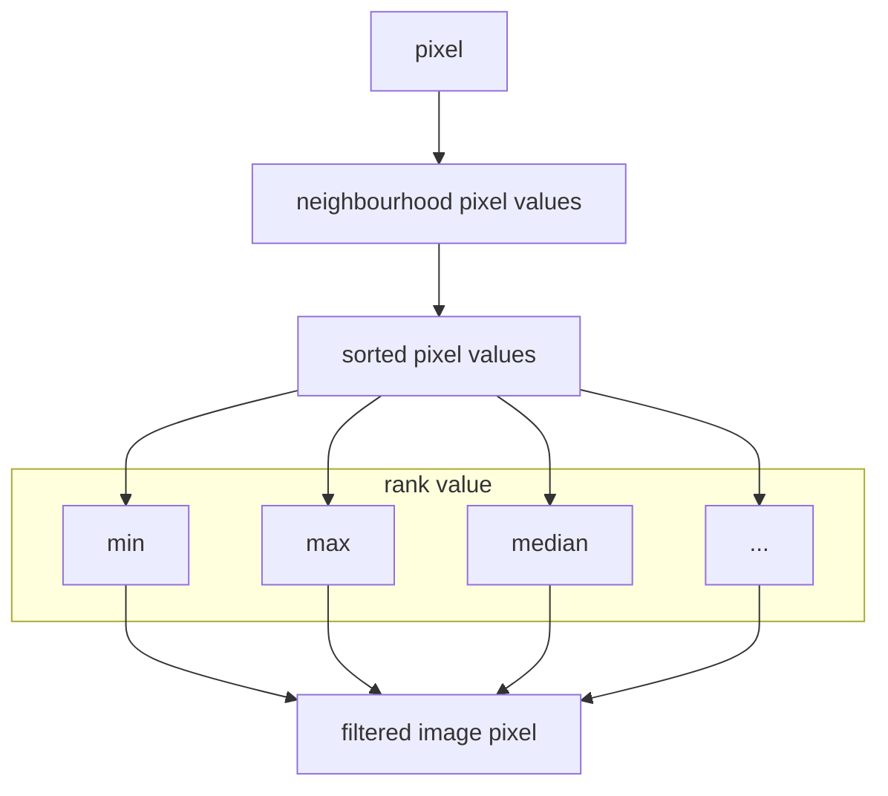

# Rank filters

## Basic rank filters

## Requirements

To understand this episode you need to know:

- Pixel properties
- Neighbourhood filters

## Motivation

In this module one would learn basic principles of rank image filters and understand when using this type filters might be beneficial.

## Learning objectives

- Understand how rank filters function.
- Execute and compare several rank filters.
- Compare image smoothing using rank (e.g. median) vs another filter type (e.g. mean).

## Concept map

### Activity: Explore rank filters on grayscale images

- Open image: xy_8bit__two_noisy_squares_different_size.tif
- Explore how a median filter
	- removes noise
	- removes small structures
	- preserves egdes
- Compare median filter to mean filter of same radius

### Formative assessment

True or false? Discuss with your neighbour!

1. Median filter is just another name for mean filter.
2. Small structures can completely disappear from an image when applying a median filter.

### Learn next

- median based local background subtraction
