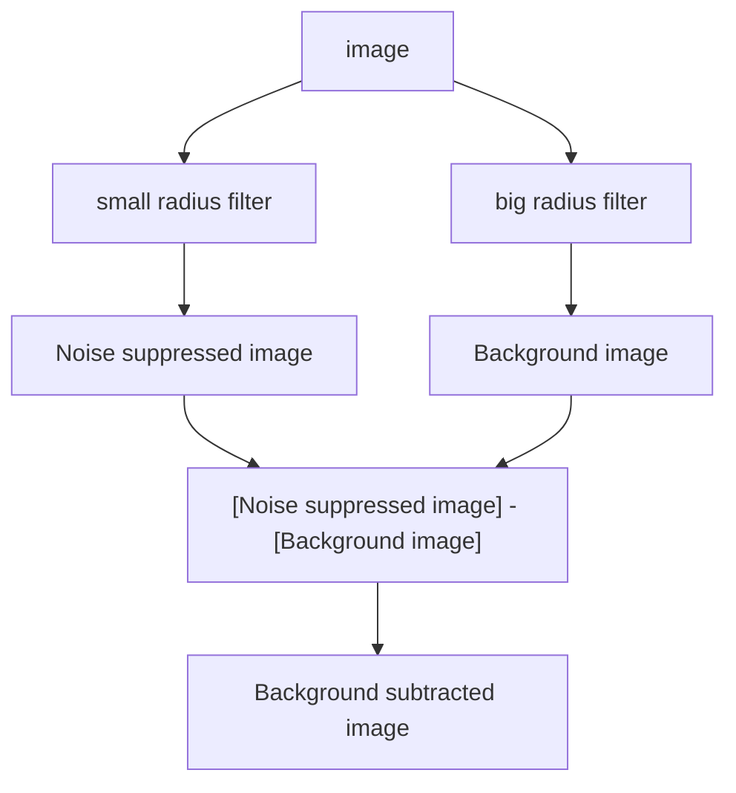

# Local background subtraction

## Requirements

- Neighbourhood filters
- Rank filters
- Convolutional filters
- Pixel math

## Motivation

This module explains how to remove background which has different values in different image parts.

## Learning objectives

- Understand how to use filters to create background image
- Learn differences between different methods/filters for generating background image 
- Practice background subtraction

## Concept map

## Possible filters for creating bacground image

- Median filter
- Opening filter: the result of background subtraction operation is called **Top-Hat filter**
- Gaussian filter

## Activity: Implement a tophat filter
- Devise code implementing a tophat filter, using minimum and maximum filters

### Activity: Explore tophat filter

- Open image: xy_8bit__spots_local_background.tif
- Use a tophat filter to remove local background

## Activity: Explore tophat filter on biological data

- Open image: xy_16bit__autophagosomes.tif 
- Appreciate that you cannot readliy segment the spots.
- Use a tophat filter to remove local background.
- Threshold the spots in the tophat filtered image.

## Activity: Explore tophat filter on noisy data

- Open image: xy_8bit__spots_local_background_with_noise.tif 
- Use topHat filter to remove local background
- Appreciate that noise poses a challenge to the tophat filter

### Activity: Implement median based background subtraction

- Write code to implement a median based background subtraction

### Activity: Explore median filter for local background subtraction

- Open images: 
	- xy_8bit__spots_local_background.tif 
	- xy_8bit__spots_local_background_with_noise.tif 
- Use tophat filter to remove local background
- Devise code to implement a tophat filter using basic functions

### Formative assessment

Answer below questions. Discuss with your neighbour!

1. What could one do to close small gaps in a binary image? 
2. What could one do to remove small objects in a image?
3. What could you use for local background subtraction in a very noisy image?

