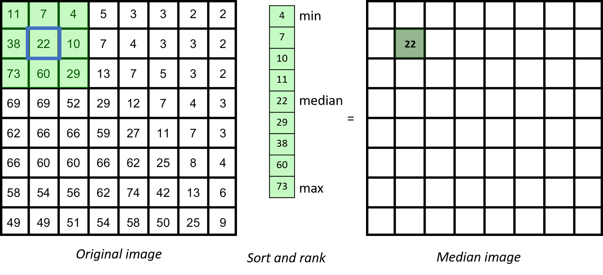

## Properties of median filter

The median filter is based on ranking the pixels in the neighbourhood

In general, for any neighbourhood filter, if the spatial extend of the neighbourhood is significantly 
(maybe three-fold) smaller than the smallest spatial length scale that you care about, you are on the safe side.

However, in biology, microscopy images are often containing relevant information down to the level of a single pixel. Thus, you typically have to deal with the fact that filtering may alter your image in a significant way. To judge whether this may affect your scientific conclusions you therefore should study the effect of filters in some detail.

Although a median filter typically is applied to a noisy gray-scale image, understanding its properties is easier when looking at a binary image.

From inspecting the effect of the median filter on above test image, one could say that a median filter
- is edge preserving
- cuts off at convex regions
- fills in at concave regions
- completely removes structures whose shortest axis is smaller than the filter width
