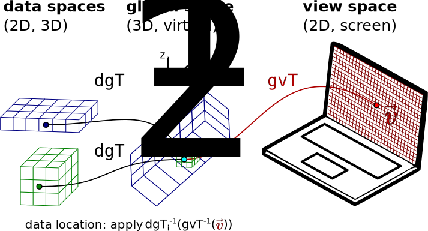

# Practical session MoBIE
## EMBO Practical Course Volume Correlative Light Electron Microscopy
### 07 – 12 July 2024 | London, United Kingdom

## Prerequisites

* We assume knowledge about the structure of microscopy images. A good basic introduction can be found [here](https://neubias.github.io/training-resources/pixels/index.html).
* Basic knowledge on using [Fiji](https://fiji.sc)/ ImageJ is also needed.
* Here is some more helpful training material on [volume slicing](https://neubias.github.io/training-resources/volume_slicing/index.html), [spatial calibration](https://neubias.github.io/training-resources/spatial_calibration/), [image transformations](https://neubias.github.io/training-resources/similarity_transforms/index.html).

### IT Setup

- All software is already provided in the VMs for the course. 
- If you like to redo the practical on another computer (MoBIE does not need specific resources), you need a fresh [Fiji](https://fiji.sc) installation. Then, install the MoBIE plugin following [this tutorial](https://mobie.github.io/tutorials/installation.html).

## Trainer

- Martin Schorb (EMBL)

## Teaching content

### getting started with MoBIE
#### concepts and project structure

MoBIE allows access to large imaging projects in a fast and reproducible way. You can explore and browse data that is stored locally or available over the network.

- a MoBIE **project** can contain different **"datasets"**.
- **dataset**: contains everything that should be visualized **together**. (In a combined **"view"**)
- A **"view"** contains the information on **how which** data is shown.

More information is available in the MoBIE [schema specification](https://mobie.github.io/specs/mobie_spec.html).

#### GUI and basic usage

Let's quickly look at the [basic tutorial](https://mobie.github.io/tutorials/explore_a_project.html) to understand how the MoBIE GUI works.

### general concepts of image registration and visualization

- what is the conceptual difference between an image file, a representation in physical space and how data is displayed.

Let's quickly explore a CLEM dataset and see how MoBIE can visualize multimodal data:

This will follow the module: ["Correlative image rendering"](https://neubias.github.io/training-resources/correlative_image_rendering/index.html).

##  volume CLEM registration

We will follow the MoBIE tutorial ["volume registration"](https://mobie.github.io/tutorials/volume_registration.html). The data is already available locally, so we can skip downloading it.
