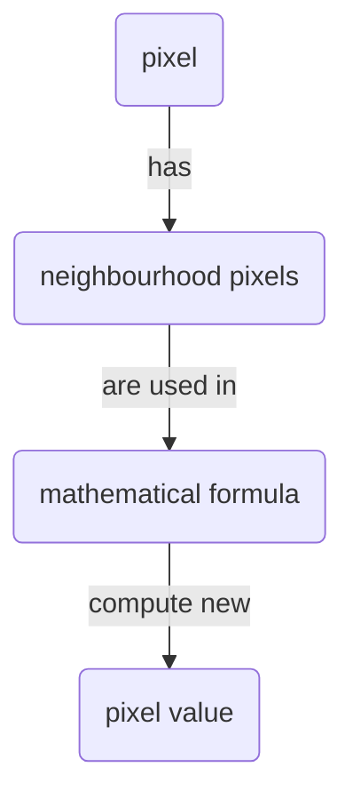

# Neighborhood filters

## Requirements

- Pixel properties

## Motivation

This module explains how image features (objects) can be enhanced using filters

## Learning objectives

- Understand the basic principle of a neighbourhood filter.

## Concept map

|   |   |   |   |   |   |   |   |
|---|---|---|---|---|---|---|---|
| NC  | NC  | NC  |   |   |   |   |   |
| NC  | C, NC  | NC  |   |   |   |   |   |
| NC  | NC  | NC  |   |   |   |   |   |
|   |   |   |   | NB  | NB  | NB  |   |
|   |   |   |   |  NB | B, NB| NB  |   |
|   |   |   |   |  NB |  NB |  NB |   |
|   |   |   |   |   |   |   |   |

## Example

TODO: Mean filter image

## Activity: Use mean filter to facilitate image binarization

* Open image: xy_8bit__nuclei_noisy_different_intensity.tif
* Appreciate that you cannot readily apply a threshold to binarize the image into two nuclei and background
* Apply a mean filter, exploring different neighbourhood sizes
* Appreciate that the filtered pixel values are slightly wrong due to integer data type
* Binarize the filtered image by applying a threshold

