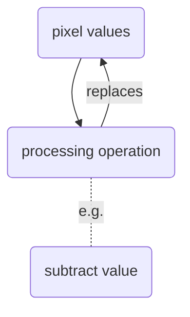
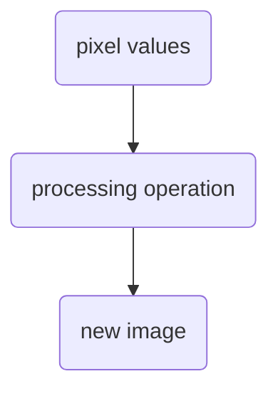
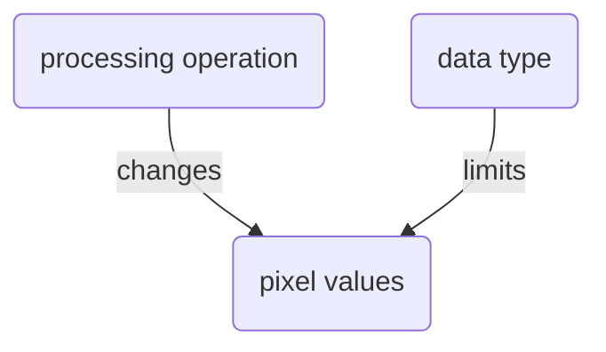

## Pixel processing 

### Activity: Pixel based background subtraction

* Open image: xy_8bit__nuclei_noisy_different_intensity.tif
* Appreciate the significant background intensity
* Measure pixel values at `[ 28, 35 ]` and `[ 28, 39 ]`
* Measure the image background intensity in this region:
    * upper left corner at `[ 20, 35 ]`
    * width = 10
    * height = 10
* Subtract the measured background intensity from each pixel.
* Measure the pixel values again.
* Observe that the resuls are incorrect.

Repeat above activity, but:

* After opening the image, convert its data type to floating point.

### Activity: Explore the limitations of `float` data type

* Create an empty image
* Set all pixel values to 1000000000.0
* Add 1.0 to all pixel values
* Be shocked...

...it turns out that from 16777216 on you cannot represent all integers anymore within a float.

### Formative Assessment

True or false?

* Subtracting 100 from 50 in a 8-bit image will result in -50.
* Adding 1 to 255 in a 8-bit image will result in 256.
* Subtracting 10.1 from 10.0 in a float image will result in -0.1
* Adding 1.0 to 255.0 in a float image will result in 256.0
* Adding 1000.0 to 1000000000.0 in a float image will result in 1000001000.0

### Learn more

* [Limitations of float](https://randomascii.wordpress.com/2012/02/13/dont-store-that-in-a-float/)

